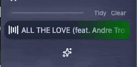

<div align="center">
    
</div>

<div align="center">
    <h1>Awesome Vivaldi</h1>
<div align="center">

[](https://deepwiki.com/PaRr0tBoY/Awesome-Vivaldi)
[](https://forum.vivaldi.net/topic/112064/modpack-community-essentials-mods-collection?_=1761221602450)


</div>
    <p>Vivaldi 浏览器精选社区修改包</p>

<div align="center">

[English](../../README.md) | **简体中文**

</div>

<!-- 


<br/>

<br/> -->

</div>

<br/>

# 目录

- [简介](#简介)
- [功能展示](#功能展示)
- [主要文件结构](#主要文件结构)
- [安装](#安装)
- [社区修改](#社区修改)

# 简介

本修改包支持两个版本的 Vivaldi。

- [Vivaldi 7.9 最新版](./Vivaldi7.9Stable) 开发中
- [Vivaldi 7.6.\*](./Vivaldi7.6Stable) 已废弃

请选择与你 Vivaldi 版本匹配的修改包。如何查看 Vivaldi 版本：在地址栏输入 `vivaldi:about`。

# 功能展示

| 演示                                                    | 修改                                                              |
| ------------------------------------------------------- | ----------------------------------------------------------------- |
|  | `FavouriteTabs.css`                                               |
|        | `TidyTabs.css` + `TidyTabs.js` + `ClearTabs.js` + `TidyTitles.js` |
|        | `PeekTabbar.css`                                                  |
|              | `ArcPeek.css` + `ArcPeek.js`                                      |
|            | `Quietify.css`                                                    |

# 主要文件结构

```
.
├── Vivaldi7.6Stable
│   ├── CSS
│   └── Javascripts
└── Vivaldi7.9Stable
    ├── CSS
    └── Javascripts
```

# 安装

各版本的安装指南位于对应的修改包目录下。

- [Vivaldi 7.9 最新版安装指南](./Vivaldi7.9Stable/README.md)
- [Vivaldi 7.6.\* 安装指南](./Vivaldi7.6Stable/README.md)

</details>

<details>
<summary><h1>社区修改</h1></summary>

# 本修改包包含的社区 JS 修改和 CSS

[📸 元素捕获](https://forum.vivaldi.net/topic/103686/element-capture?_=1758777284963)

> 此修改添加了在截屏时自动选择区域进行捕获的功能。

[彩色标签页](https://forum.vivaldi.net/topic/96586/colorful-tabs?_=1758775816485)

> 从图标计算颜色的部分代码

[单色图标](https://forum.vivaldi.net/topic/102661/monochrome-icons?_=1758775889576)

> 此修改更改所有网页面板图标的色调，使其成为单色。网页面板会使面板变得过于繁忙，颜色到处都是，因此稍微降低它们的色调并让它们更好地融合是有意义的。

[导入导出命令链](https://forum.vivaldi.net/topic/93964/import-export-command-chains?page=1)

> 此修改帮助导入和导出 Vivaldi 的命令链。
> 此修改附带通过 Vivaldi 论坛的代码块 (```) 直接安装导出代码的功能。

[📂 简便文件](https://forum.vivaldi.net/topic/94531/easy-files?page=1)

> 此修改受 Opera 启发。通过显示剪贴板中的文件和下载的文件，使附加文件更容易。

[点击添加阻止列表](https://forum.vivaldi.net/topic/45735/click-to-add-blocking-list)

> 此修改添加了通过点击网站中的链接来添加阻止列表的支持，类似其他广告拦截器。

[全局媒体控制面板](https://forum.vivaldi.net/topic/66803/global-media-controls-panel)

> 此修改将在 vivaldi 的面板中添加全局媒体控制，类似于 Chrome 中的全局媒体控制

[笔记的 Markdown 编辑器](https://forum.vivaldi.net/topic/35644/markdown-editor-for-notes)

> 笔记编辑器的简单 Markdown 编辑器

[鼠标悬停时打开面板](https://forum.vivaldi.net/topic/28413/open-panels-on-mouse-over/22?_=1593504963587)

> 鼠标悬停到正文时自动关闭
> 如果在超时期限前鼠标退出屏幕则不打开
> 基于情况的独特延迟

[仪表板伪装：仪表板网页的主题集成](https://forum.vivaldi.net/topic/102173/dashboard-camo-theme-integration-for-dashboard-webpages/3)

> 它获取 Vivaldi 根据你的主题设置的所有自定义 CSS 属性，并将它们传递给所有网页小部件，你可以在其中使用它们来设置你的自定义小部件的样式。

[彩色顶部加载栏](https://forum.vivaldi.net/topic/111621/colorful-top-loading-bar?_=1758776810153)

> 使 Vivaldi 的标题栏在网页加载时视觉上吸引人的 JS 和 CSS。

[Feed 图标](https://forum.vivaldi.net/topic/73001/feed-icons?_=1758776884927)

> 这是一个将 feed 图标转换为网站图标的小修改。

[类似 Yandex 浏览器的地址栏](https://forum.vivaldi.net/topic/96072/address-bar-like-in-yandex-browser?_=1758776929535)

> 使地址栏显示当前页面的标题和域，点击该域可进入网站的主页。

[在对话框中打开修改](https://forum.vivaldi.net/topic/92501/open-in-dialog-mod/95?_=1758776959371)

> 在对话框弹出窗口中打开链接或搜索的修改。

[两级标签堆栈的自动展开和折叠标签栏：重做](https://forum.vivaldi.net/topic/111893/auto-expand-and-collapse-tabbar-for-two-level-tab-stack-rework?_=1758777265037)

> 自动展开和折叠标签栏

[主题预览增强 | Vivaldi Forum](https://forum.vivaldi.net/topic/103422/theme-previews-plus?_=1759122196203)

> 使主题预览正确反映你的标签栏、地址栏和面板栏的实际位置，以及在启用时显示浮动标签页。
>
> 注意：此修改仅在设置页面在标签页中打开时有效（在 vivaldi://settings/appearance/ 中启用"在标签页中打开设置"）。

[tovifun/VivalArc: 只需几个调整，你就可以给 Vivaldi 那种酷炫的 Arc 感觉](https://github.com/tovifun/VivalArc)

> 使用了此仓库中的部分代码。

</details>

---

[](https://github.com/PaRr0tBoY/Awesome-Vivaldi)

