<div align="center">
    
</div>

<div align="center">
    <h1>Awesome Vivaldi</h1>
<div align="center">

[](https://deepwiki.com/PaRr0tBoY/Awesome-Vivaldi/2.3.1-main-ui-styles)
[](https://forum.vivaldi.net/topic/112064/modpack-community-essentials-mods-collection?_=1761221602450) 
 
 
</div>
    <p>A Curated Community Mod Pack</p>

<!-- 


<br/>

<br/> -->

</div>

<br/>

## Features

### MainShowCase
| Features | Preview |
| :--- | :--- |
| **Arc-Style Sidebar**<br>• Modern sidebar design<br>• Quick access to frequently used features | 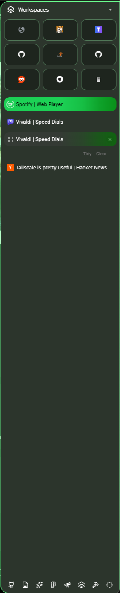 |
| **Clean New Tab Page**<br>• Minimalist interface layout<br>• Fast access to favorite websites | 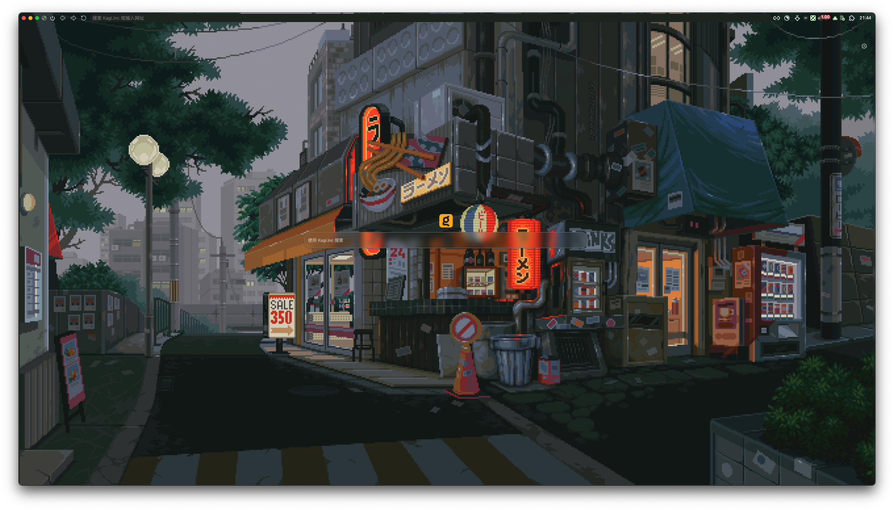 |
| **Expanded Webview**<br>• Optimized page display area<br>• Enhanced browsing experience | 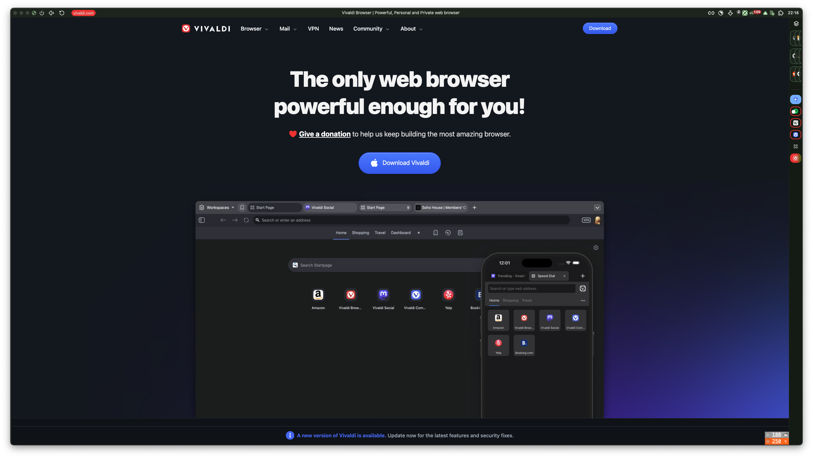 |
| **Dynamic Theme Colors**<br>• Automatic system theme adaptation<br>• Smooth color transition effects | 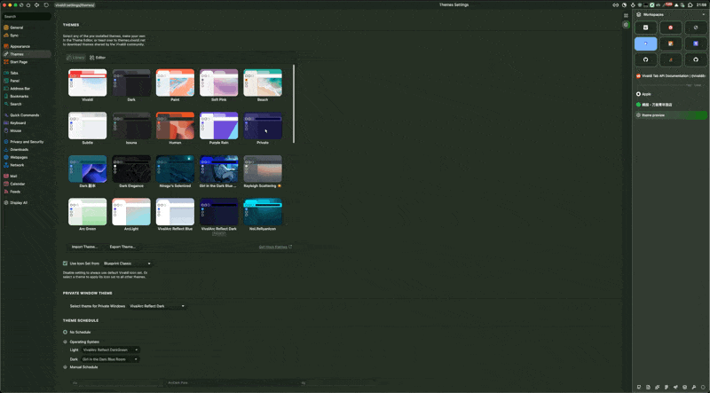 |
| **Smart Sidebar Animations**<br>• Smooth expand/collapse transitions<br>• Intelligent show/hide functionality | 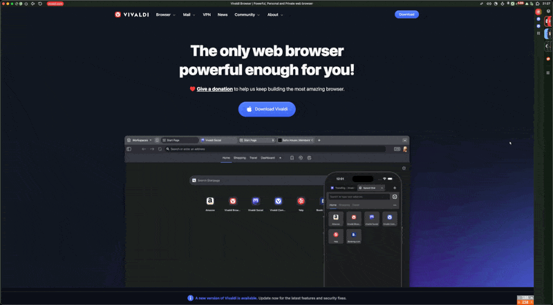 |


### Let’s Make it Arc

<table>
<tr>
<td>Arc Peek</td>
<td>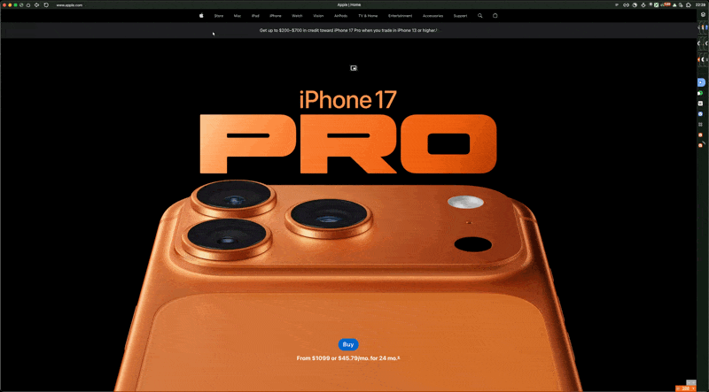</td>
</tr>
<tr>
<td>Tidy Tabs with AI Powered</td>
<td>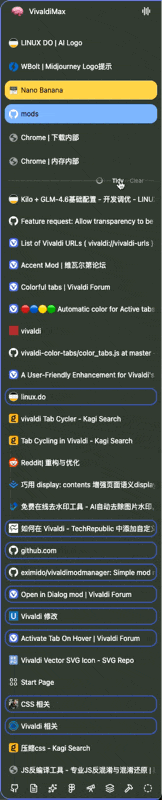</td>
</tr>
<tr>
<td>Tidy Titles With AI Powered</td>
<td>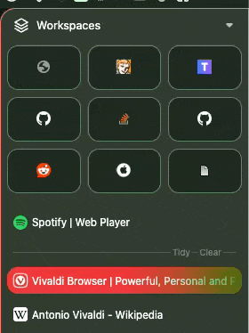</td>
</tr>
<tr>
<td>Clear Tabs</td>
<td>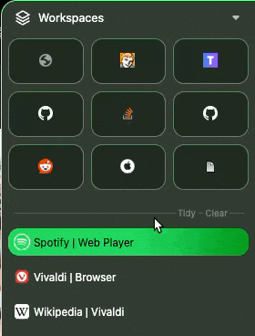</td>
</tr>
<tr>
<td>Peek Favourites Tab Title</td>
<td>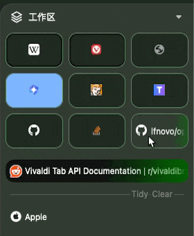</td>
</tr>
<tr>
<td>Pin Favourite Tabs</td>
<td>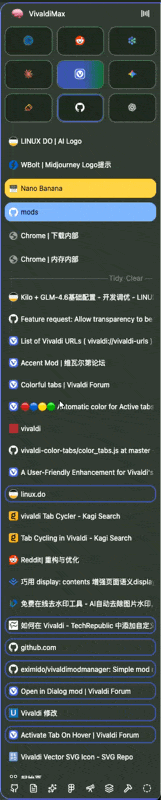</td>
</tr>
</table>

### Nice to Have Features

<table>
<tr>
<td>Sleek Audio Icon</td>
<td></td>
</tr>
<tr>
<td>Global Media Control</td>
<td>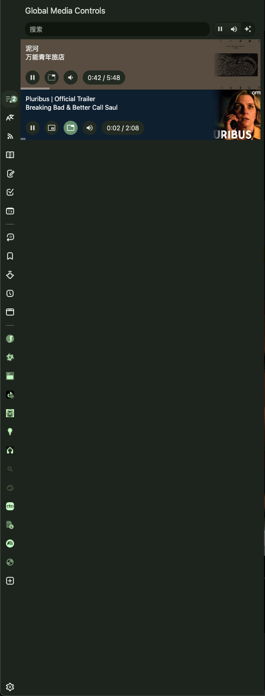</td>
</tr>
<tr>
<td>Who Needs a Disabled Button?</td>
<td>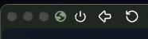</td>
</tr>
<tr>
<td>Select Files From Your History Downloads</td>
<td></td>
</tr>
<tr>
<td>Adds a Trail to Hovered and Active Tabs, Close Buttons As Well</td>
<td>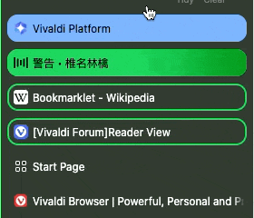</td>
</tr>
<tr>
<td>BiggerView</td>
<td></td>
</tr>
</table>

<details>
<summary>Legacy Features (Outdated)</summary>

Original features table is Outdated. See [[Modpack] Community Essentials Mods Collection | Vivaldi Forum](https://forum.vivaldi.net/topic/112064/modpack-community-essentials-mods-collection?_=1761491359483) for outdated introduction to this modpack.

</details>

<details>
<summary>How to Install:</summary>

# Adjust Vivaldi Settings

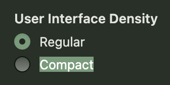

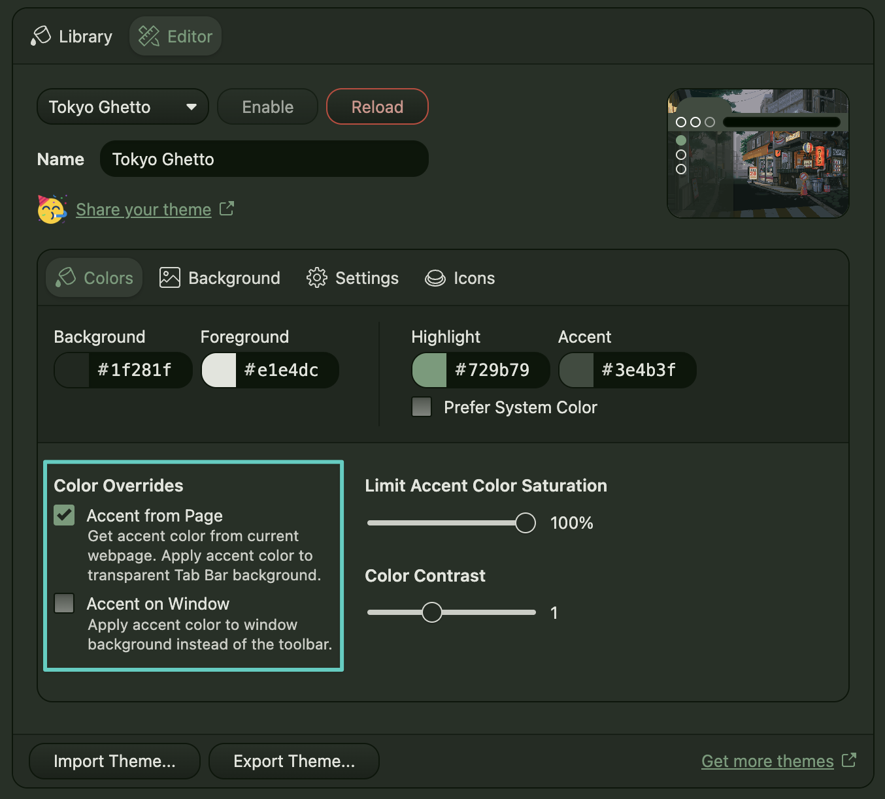

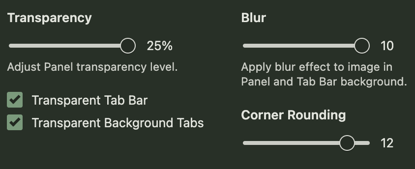

# Install Mods

==**BACKUP ALL NECESSARY FILES BEFORE STARTING**==

## To install CSS:

1. Open 'Vivaldi://experiments' in Vivaldi and check 'Allow CSS Modification'
2. Restart Vivaldi
3. Clone this repo
4. Under 'CSS/' there's a file called 'Core.css' that import all css mods in this modpack,
   You can also find all configurations of all the css mods in this mod pack;
   Which means you can toggle on/off all your css mods as well as persist your configuration when updating all in one place.
5. Go to Settings->Appearance and you'll see 'CUSTOM UI MODIFICATIONS'. Select file location as "/path/to/Awesome-Vivaldi/CSS"
6. Restart Vivaldi, you're all set!

## To install Javascript moddings(Automatically)

1. If you're on windows, use [Vivaldi Mod Manager](https://github.com/eximido/vivaldimodmanager)
2. If you're on linux, see [Vivaldi-Autoinject-Custom-js-ui](https://aur.archlinux.org/vivaldi-autoinject-custom-js-ui.git) for more info
3. See also [Patching Vivaldi with batch scripts](https://forum.vivaldi.net/topic/10592/patching-vivaldi-with-batch-scripts/21?page=2) for all platform
4. If you're on macOS use [macOS_Patch_Scripts | upviv](https://github.com/PaRr0tBoY/Vivaldi-Mods/blob/8a1e9f8a63f195f67f27ab2e5b86c4aff0081096/macOS_Patch_Scripts/upviv) as a reference for patchscript

## To install Javascript moddings(Manually):

1. Duplicate javascripts file under moddings to `<YOURVIVALDIDIRECTORY>`\Application\<VERSI0N>\resources\vivaldi.
2. Under the same folder, there's a window.html  and you should fill in your js file name one by one in `<body>`, after that
   your window.html should look something like this.

```html
<!-- Vivaldi window document -->
<!DOCTYPE html>
<html>
<head>
  <meta charset="UTF-8" />
  <title>Vivaldi</title>
  <link rel="stylesheet" href="style/common.css" />
  <link rel="stylesheet" href="chrome://vivaldi-data/css-mods/css" />
</head>

<body>
<script src="tidyTitles.js"></script>\
<script src="tidyTabs.js"></script>\
<script src="clearTabs.js"></script>\
<script src="mainbar.js"></script>\
<script src="wrapToday.js"></script>\
<script src="immersiveAddressbar.js"></script>\
<script src="monochromeIcons.js"></script>\
<script src="ybAddressBar.js"></script>\
<script src="mdNotes.js"></script>\
<script src="elementCapture.js"></script>\
<script src="globalMediaControls.js"></script>\
<script src="autoHidePanel.js"></script>\
<script src="easyFiles.js"></script>\
<script src="dialogTab.js"></script>\
<script src="feedIcon.js"></script>\
<script src="adaptiveWebPanelHeaders.js"></script>\
<script src="collapseKeyboardSettings.js"></script>\
<script src="accentMod.js"></script>\
<script src="moonPhase.js"></script>\
<script src="backupSearchEngines.js"></script>\
<script src="importExportCommandChains.js"></script>\
<script src="tabScroll.js"></script>\
<script src="activateTabOnHover.js"></script>\
</body>

</html>

```

3. That's it!

### Advanced Reading

1. you can patch vivaldi with batch scripts. To learn more check [Patching Vivaldi with batch scripts](https://forum.vivaldi.net/topic/10592/patching-vivaldi-with-batch-scripts/21?page=2)
2. To learn more about js modification for Vivaldi check [Modding Vivaldi | Vivaldi Forum](https://forum.vivaldi.net/topic/10549/modding-vivaldi?page=1)
3. To learn more about css modification for Vivaldi by yourself check [Inspecting the Vivaldi UI with DevTools | Vivaldi Forum](https://forum.vivaldi.net/topic/16684/inspecting-the-vivaldi-ui-with-devtools?page=1)
4. If you're on macOS use [macOS_Patch_Scripts | upviv](https://github.com/PaRr0tBoY/Vivaldi-Mods/blob/8a1e9f8a63f195f67f27ab2e5b86c4aff0081096/macOS_Patch_Scripts/upviv) as a reference for patchscript
5. Arc like workspace switcher tutorial:[Paweł shows you how to play with Workspaces and Custom Icons in Vivaldi. | Vivaldi Browser](https://vivaldi.com/blog/how-to/pawel-shows-you-how-to-play-with-workspaces-and-custom-icons-in-vivaldi/)

</details>

[](https://github.com/PaRr0tBoY/Awesome-Vivaldi)

<details>
<summary>Community Mods:</summary>

# Community JS Mods And CSS Included In This Modpack

[📸 Element Capture](https://forum.vivaldi.net/topic/103686/element-capture?_=1758777284963)

> This mod adds the function of automatically selecting the area to capture when taking screenshots.

[Colorful tabs](https://forum.vivaldi.net/topic/96586/colorful-tabs?_=1758775816485)

> Part of the code that calculates the color from an icon

[Monochrome icons](https://forum.vivaldi.net/topic/102661/monochrome-icons?_=1758775889576)

> This modification changes the hue of all web panel icons and makes them monochrome. The panel becomes overtly busy and the colors are all over the place with web panels, therefore it makes sense toning them down somewhat and letting them blend in more.

[Import Export Command Chains](https://forum.vivaldi.net/topic/93964/import-export-command-chains?page=1)

> This mods helps import and export command chains for Vivaldi.
> This mod comes with the ability to directly install code exported through the code block (```) of the Vivaldi forum.

[📂 Easy Files](https://forum.vivaldi.net/topic/94531/easy-files?page=1)

> This mod is inspired by opera. It makes attaching files easier by displaying files in the clipboard and downloaded files.

[Click to add Blocking list](https://forum.vivaldi.net/topic/45735/click-to-add-blocking-list)

> This mod add support for adding the block list by clicking on the link in sites like other adblock.

[Global Media Controls Panel](https://forum.vivaldi.net/topic/66803/global-media-controls-panel)

> This mod will add a Global Media Controls in vivaldi's panel similar to Global Media Controls in chrome

[Markdown Editor for Notes](https://forum.vivaldi.net/topic/35644/markdown-editor-for-notes)

> Simple Markdown Editor for Notes Editor

[Open panels on mouse-over.](https://forum.vivaldi.net/topic/28413/open-panels-on-mouse-over/22?_=1593504963587)

> Auto-close when you mouse over to body
> Don't open if mouse exits screen before timeout period
> Unique delays based on situation

[Dashboard Camo: Theme Integration for Dashboard Webpages](https://forum.vivaldi.net/topic/102173/dashboard-camo-theme-integration-for-dashboard-webpages/3)

> It takes all the custom CSS properties which Vivaldi sets according to your theme and passes them to all webpage widgets, where you can use them for styling your custom widgets.

[Colorful Top Loading Bar](https://forum.vivaldi.net/topic/111621/colorful-top-loading-bar?_=1758776810153)

> A JS and CSS that make Vivaldi's Title bar visually appealing when a webpage is loading.

[Feed icons](https://forum.vivaldi.net/topic/73001/feed-icons?_=1758776884927)

> This is a small mod that converts feed icons into website icons.

[Address Bar like in Yandex Browser](https://forum.vivaldi.net/topic/96072/address-bar-like-in-yandex-browser?_=1758776929535)

> Make address bar displays the title of the current page and the domain, clicking on which leads to the homepage of the website.

[Open in Dialog mod](https://forum.vivaldi.net/topic/92501/open-in-dialog-mod/95?_=1758776959371)

> A mod to open links or a search in a dialog popup.

[Auto expand and collapse tabbar for two-level tab stack: Rework](https://forum.vivaldi.net/topic/111893/auto-expand-and-collapse-tabbar-for-two-level-tab-stack-rework?_=1758777265037)

> Auto expand and collapse tabbar

[Auto expand and collapse tabbar for two-level tab stack: Rework](https://forum.vivaldi.net/topic/111893/auto-expand-and-collapse-tabbar-for-two-level-tab-stack-rework?_=1758777265037)

> Auto expand and collapse tabbar

[Theme Previews Plus | Vivaldi Forum](https://forum.vivaldi.net/topic/103422/theme-previews-plus?_=1759122196203)

> To make theme preview properly reflect the actual placement of your tab bar, address bar, and panel bar, as well as show floating tabs when those are enabled.
>
> NOTE: This mod only works when the settings page is opened in a tab ("Open Settings in a Tab" is enabled in vivaldi://settings/appearance/).

[tovifun/VivalArc: With just a few tweaks, you can give Vivaldi that cool Arc vibe](https://github.com/tovifun/VivalArc)

> Part of codes in this repo is used.

</details>
