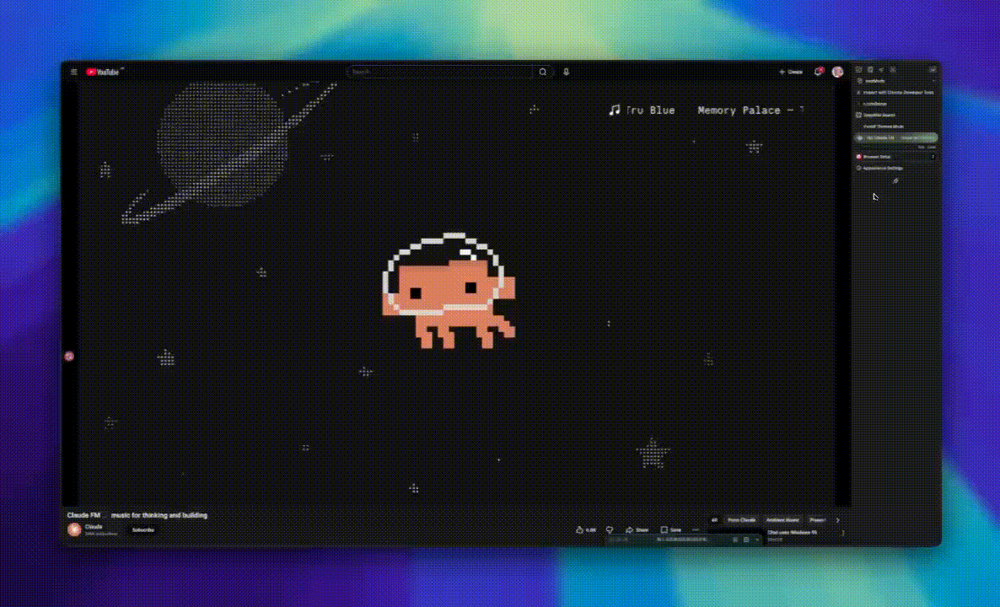
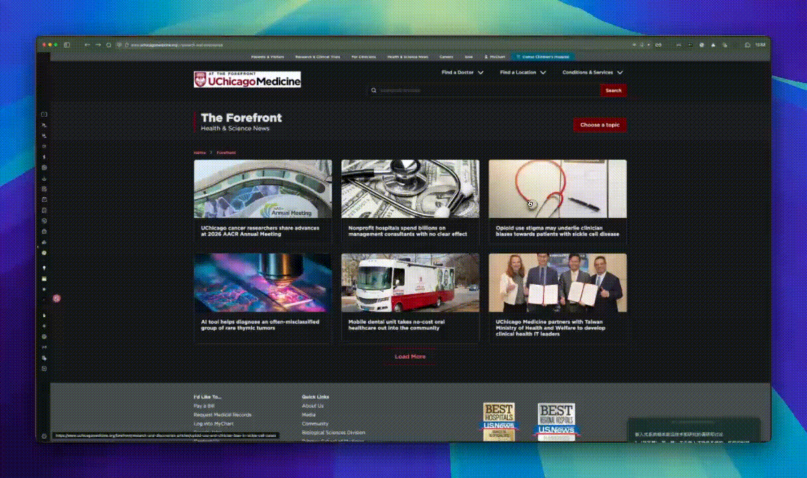
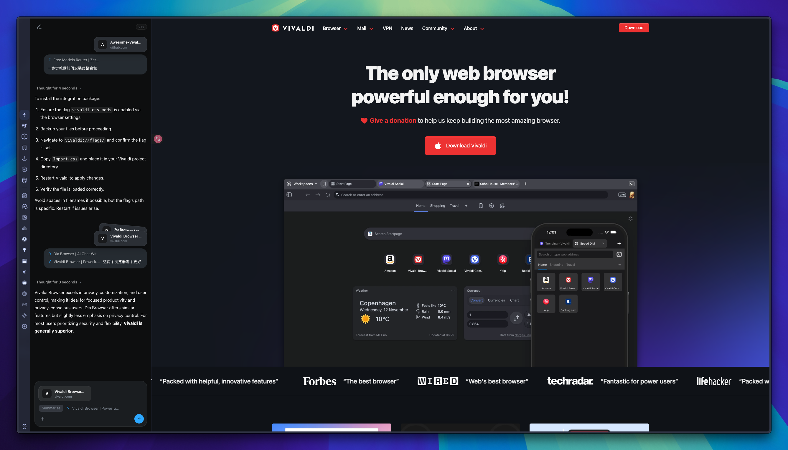

# Awesome Vivaldi


&nbsp;

## Table of Contents

- [Latest Updates](#latest-updates)
- [Introduction](#introduction)
- [Feature Showcase](#feature-showcase)
- [Vivaldi Max (AI Features)](#vivaldi-maxai-features)
- [Mod List](#mod-list)
- [Installation](#installation)
- [Community Mods](#community-mods)
- [Development Reference](#development-reference)

## Latest Updates

| Showcase                                                    | Mods                                   |
| ----------------------------------------------------------- | -------------------------------------- |
|                     | `VividToast.css` + `VividToast.js` |
|            | `VividPeek.js`                       |
|  | `restorepinnedtab.js`                |

## Introduction

This modpack is always updated with Vivaldi, [Vivaldi 8 latest](./Vivaldi8.0Stable) is currently supported.

> Which version of Vivaldi browser are you using? If you're not sure, check it out at `vivaldi:about`.

## Feature Showcase

| Showcase                                            | Mods                                     |
| --------------------------------------------------- | ---------------------------------------- |
|            | `VividPeek.css` + `VividPeek.js`     |
|      | `VividPlayer.css` + `VividPlayer.js` |
|  | `FavouriteTabs.css`                    |
|        | `PeekTabbar.css`                       |
|            | `Quietify.css`                         |

## Vivaldi Max(AI Features)

| Showcase                                            | Mods                                                   |
| --------------------------------------------------- | ------------------------------------------------------ |
|          | `TidyTabs.css` + `TidyTabs.js` + `TidyTitles.js` |
|  | `TidyDownloads.js`                                   |
|      | `TidyAddress.js`                                     |
|          | `AskOnPage.js`                                       |

## Mod List

&nbsp;

### CSS

| File                  | Description                                                 |
| --------------------- | ----------------------------------------------------------- |
| `AdaptiveBF.css`      | Hide back/forward buttons when unnecessary                  |
| `VividPeek.css`       | Arc peek experience (pair with `VividPeek.js`)              |
| `BetterAnimation.css` | Smoother overscroll animation                               |
| `BtnHoverAnime.css`   | Button hover animation *(disabled by default)*              |
| `DownloadPanel.css`   | Download panel theming                                      |
| `Extensions.css`      | Extensions dropdown as list, overflow handling              |
| `FavouriteTabs.css`   | Arc-like favorite tabs grid (first 9 pinned tabs)           |
| `FindInPage.css`      | Floating find bar                                           |
| `VividQC.css`         | Arc-like quick command styling                              |
| `LineBreak.css`       | Utility / omit it                                           |
| `PeekTabbar.css`      | Peek tabbar on hover with 2-level stacking                  |
| `Quietify.css`        | Sleeker audio indicator                                     |
| `RemoveClutter.css`   | Hide scrollbars & visual clutter                            |
| `TabsTrail.css`       | Green trail on active/hovered tabs                          |
| `TidyTabs.css`        | AI tab grouping *(requires* `TidyTabs.js`*)*                    |
| `VivalArc.css`        | Arc theme port *(incompatible with this modpack)*           |

### Javascripts

| File                     | Description                                                     |
| ------------------------ | --------------------------------------------------------------- |
| `VividPeek.js`           | [Arc peek dialog support](./Doc/mod/VividPeek.md) *(pairs with* `VividPeek.css`*)* |
| `AskOnPage.js`           | [AI side panel for page questions, summaries, and rewrites](./Doc/mod/AskOnPage.md) |
| `AutoHidePanel.js`       | [Auto-hide side panel](./Doc/mod/AutoHidePanel.md) |
| `EasyFiles.js`           | [Opera-inspired file attachment via clipboard &amp; downloads](./Doc/mod/EasyFiles.md) |
| `ModConfig.js`           | [Shared settings panel for AI keys and supported mods](./Doc/mod/ModConfig.md) |
| `MonochromeIcons.js`     | [Monochrome web panel icons to reduce visual noise](./Doc/mod/MonochromeIcons.md) |
| `QuickCapture.js`        | [Auto-select capture area with clipboard/file/default modes](./Doc/mod/QuickCapture.md) |
| `TidyDownloads.js`       | [AI download filename cleanup](./Doc/mod/TidyDownloads.md) |
| `TidyTabs.js`            | [AI tab grouping](./Doc/mod/TidyTabs.md) *(pairs with* `TidyTabs.css`*)* |
| `TidyTitles.js`          | [AI tab title cleanup](./Doc/mod/TidyTitles.md) |
| `TabManager.js`          | [Workspace Board panel for viewing and managing workspace tabs](./Doc/mod/TabManager.md) |
| `TidyAddress.js`         | [Rewrites the visible URL suffix into an AI-generated slug](./Doc/mod/TidyAddress.md) |
| `VividToast.js`          | [Toast notification logic](./Doc/mod/VividToast.md) *(pairs with* `VividToast.css`*)* |

&nbsp;

## Installation

If you have installed Claude Code or other agents, ask it to:

```
Guide me through the installation of https://github.com/PaRr0tBoY/Awesome-Vivaldi
```

If not:

- [Click me](./Vivaldi8.0Stable/README.md) to navigate to the Installation Guide for Vivaldi 7.9 latest

&nbsp;

## Community Mods

### Community JS Mods And CSS Included In This Modpack

[📸 Element Capture](https://forum.vivaldi.net/topic/103686/element-capture?_=1758777284963)

> This mod adds the function of automatically selecting the area to capture when taking screenshots.

[Colorful tabs](https://forum.vivaldi.net/topic/96586/colorful-tabs?_=1758775816485)

> Part of the code that calculates the color from an icon

[Monochrome icons](https://forum.vivaldi.net/topic/102661/monochrome-icons?_=1758775889576)

> This modification changes the hue of all web panel icons and makes them monochrome. The panel becomes overtly busy and the colors are all over the place with web panels, therefore it makes sense toning them down somewhat and letting them blend in more.

[Import Export Command Chains](https://forum.vivaldi.net/topic/93964/import-export-command-chains?page=1)

> This mods helps import and export command chains for Vivaldi.
> This mod comes with the ability to directly install code exported through the code block (```) of the Vivaldi forum.

[📂 Easy Files](https://forum.vivaldi.net/topic/94531/easy-files?page=1)

> This mod is inspired by opera. It makes attaching files easier by displaying files in the clipboard and downloaded files.

[Click to add Blocking list](https://forum.vivaldi.net/topic/45735/click-to-add-blocking-list)

> This mod add support for adding the block list by clicking on the link in sites like other adblock.

[Global Media Controls Panel](https://forum.vivaldi.net/topic/66803/global-media-controls-panel)

> This mod will add a Global Media Controls in vivaldi's panel similar to Global Media Controls in chrome

[Markdown Editor for Notes](https://forum.vivaldi.net/topic/35644/markdown-editor-for-notes)

> Simple Markdown Editor for Notes Editor

[Open panels on mouse-over.](https://forum.vivaldi.net/topic/28413/open-panels-on-mouse-over/22?_=1593504963587)

> Auto-close when you mouse over to body
> Don't open if mouse exits screen before timeout period
> Unique delays based on situation

[Dashboard Camo: Theme Integration for Dashboard Webpages](https://forum.vivaldi.net/topic/102173/dashboard-camo-theme-integration-for-dashboard-webpages/3)

> It takes all the custom CSS properties which Vivaldi sets according to your theme and passes them to all webpage widgets, where you can use them for styling your custom widgets.

[Colorful Top Loading Bar](https://forum.vivaldi.net/topic/111621/colorful-top-loading-bar?_=1758776810153)

> A JS and CSS that make Vivaldi's Title bar visually appealing when a webpage is loading.

[Feed icons](https://forum.vivaldi.net/topic/73001/feed-icons?_=1758776884927)

> This is a small mod that converts feed icons into website icons.

[Address Bar like in Yandex Browser](https://forum.vivaldi.net/topic/96072/address-bar-like-in-yandex-browser?_=1758776929535)

> Make address bar displays the title of the current page and the domain, clicking on which leads to the homepage of the website.

[Open in Dialog mod](https://forum.vivaldi.net/topic/92501/open-in-dialog-mod/95?_=1758776959371)

> A mod to open links or a search in a dialog popup.

[Auto expand and collapse tabbar for two-level tab stack: Rework](https://forum.vivaldi.net/topic/111893/auto-expand-and-collapse-tabbar-for-two-level-tab-stack-rework?_=1758777265037)

> Auto expand and collapse tabbar

[Auto expand and collapse tabbar for two-level tab stack: Rework](https://forum.vivaldi.net/topic/111893/auto-expand-and-collapse-tabbar-for-two-level-tab-stack-rework?_=1758777265037)

> Auto expand and collapse tabbar

[Theme Previews Plus | Vivaldi Forum](https://forum.vivaldi.net/topic/103422/theme-previews-plus?_=1759122196203)

> To make theme preview properly reflect the actual placement of your tab bar, address bar, and panel bar, as well as show floating tabs when those are enabled.
>
> NOTE: This mod only works when the settings page is opened in a tab ("Open Settings in a Tab" is enabled in vivaldi://settings/appearance/).

[tovifun/VivalArc: With just a few tweaks, you can give Vivaldi that cool Arc vibe](https://github.com/tovifun/VivalArc)

> Part of codes in this repo is used.

&nbsp;

## Development Reference

### Vivaldi CSS Variables

Vivaldi exposes theme-aware CSS custom properties on `#browser`. These follow the user's active theme — values change with theme, so reference by `var()` name only.

| Category                             | Key variables                                                                                                                                                                                           |
| ------------------------------------ | ------------------------------------------------------------------------------------------------------------------------------------------------------------------------------------------------------- |
| **Background**                 | `--colorBg`, `--colorBgAlpha`, `--colorBgDark`/`--colorBgDarker`, `--colorBgLight`/`--colorBgLighter`, `--colorBgIntense`/`--colorBgIntenser`, `--colorBgInverse`, `--colorBgFaded` |
| **Foreground**                 | `--colorFg`, `--colorFgIntense`, `--colorFgFaded`/`--colorFgFadedMore`/`--colorFgFadedMost`                                                                                                   |
| **Highlight** (primary accent) | `--colorHighlightBg`, `--colorHighlightFg`, `--colorHighlightBgDark`, `--colorHighlightBgAlpha`                                                                                                 |
| **Accent** (secondary)         | `--colorAccentBg`, `--colorAccentFg`, `--colorAccentBorder`, `--colorAccentBgDark`/`--colorAccentBgDarker`                                                                                    |
| **Border**                     | `--colorBorder`, `--colorBorderSubtle`, `--colorBorderIntense`, `--colorBorderDisabled`                                                                                                         |
| **Semantic**                   | `--colorSuccessBg`/`Fg`, `--colorWarningBg`/`Fg`, `--colorErrorBg`/`Fg`                                                                                                                     |
| **Radius**                     | `--radius`, `--radiusHalf`, `--radiusCap`, `--radiusRound`, `--radiusRounded`                                                                                                                 |
| **Other**                      | `--colorTabBar`, `--densityGap`, `--scrollbarWidth`, `--monospaceFont`, `--sansSerifFont`, `--uiZoomLevel`                                                                                  |

---


