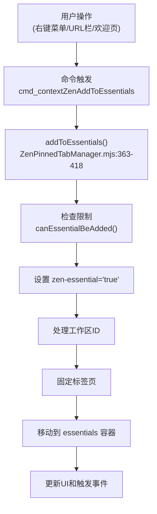

# DeepWiki Q&A with Code Context for Repository: zen-browser/desktop
## Q1
我想了解 Essential Tabs 的完整执行流。请告诉我，当用户触发这个功能时，代码的入口函数（Entry Point）在哪里？它位于哪个文件？
### Answer
## Essential Tabs 执行流入口点

Essential Tabs 功能的主要入口函数是 `gZenPinnedTabManager.addToEssentials()`，位于 `src/zen/tabs/ZenPinnedTabManager.mjs` 文件中 desktop:363-418 。

### 用户触发入口

用户可以通过以下方式触发 Essential Tabs 功能：

1. **右键菜单入口**：通过 `cmd_contextZenAddToEssentials` 命令触发 desktop:79-84 

2. **URL栏操作入口**：通过全局操作面板中的 "Add to Essentials" 选项触发 desktop:138-147 

3. **欢迎页面导入**：在首次使用时从欢迎页面导入 Essential Tabs desktop:588-604 

### 核心执行流程

当用户触发 Essential Tabs 功能时，执行流程如下：



### 关键实现细节

`addToEssentials()` 方法执行以下核心操作 desktop:363-418 ：

1. **验证限制**：检查是否超过最大 Essential Tabs 数量限制（默认12个）
2. **设置属性**：为标签页添加 `zen-essential="true"` 属性
3. **工作区处理**：移除 `zen-workspace-id` 属性，因为 Essential Tabs 跨工作区显示
4. **固定标签页**：如果标签页未固定，则调用 `gBrowser.pinTab()`
5. **移动位置**：将标签页移动到 essentials 容器中
6. **UI更新**：触发 `TabAddedToEssentials` 事件并更新工具栏

### 会话存储集成

Essential Tabs 的状态会在会话恢复时自动还原，通过 `SessionStore-sys-mjs.patch` 中的代码实现 desktop:274-277 。

## Notes

Essential Tabs 是 Zen Browser 的核心功能之一，它与工作区系统紧密集成。Essential Tags 始终固定显示，不受工作区切换影响，且不能通过正常方式关闭。最大数量限制可通过 `zen.tabs.essentials.max` 偏好设置配置（默认12个） desktop:31-33 。

Wiki pages you might want to explore:
- [Tab Management Architecture (zen-browser/desktop)](/wiki/zen-browser/desktop#2.4)
### Citations
**File:** src/zen/tabs/ZenPinnedTabManager.mjs (L31-33)
```javascript
      "zen.tabs.essentials.max",
      12
    );
```
**File:** src/zen/tabs/ZenPinnedTabManager.mjs (L363-418)
```javascript
  addToEssentials(tab) {
    // eslint-disable-next-line no-nested-ternary
    const tabs = tab
      ? // if it's already an array, dont make it [tab]
        tab?.length
        ? tab
        : [tab]
      : TabContextMenu.contextTab.multiselected
        ? gBrowser.selectedTabs
        : [TabContextMenu.contextTab];
    let movedAll = true;
    for (let i = 0; i < tabs.length; i++) {
      // eslint-disable-next-line no-shadow
      let tab = tabs[i];
      const section = gZenWorkspaces.getEssentialsSection(tab);
      if (!this.canEssentialBeAdded(tab)) {
        movedAll = false;
        continue;
      }
      if (tab.hasAttribute("zen-essential")) {
        continue;
      }
      tab.setAttribute("zen-essential", "true");
      if (tab.hasAttribute("zen-workspace-id")) {
        tab.removeAttribute("zen-workspace-id");
      }
      if (tab.pinned) {
        gBrowser.zenHandleTabMove(tab, () => {
          if (tab.ownerGlobal !== window) {
            tab = gBrowser.adoptTab(tab, {
              selectTab: tab.selected,
            });
            tab.setAttribute("zen-essential", "true");
          }
          section.appendChild(tab);
        });
      } else {
        gBrowser.pinTab(tab);
        this._ignoreNextTabPinnedEvent = true;
      }
      tab.setAttribute("zenDefaultUserContextId", true);
      if (tab.selected) {
        gZenWorkspaces.switchTabIfNeeded(tab);
      }
      this.onTabIconChanged(tab);
      // Dispatch the event to update the UI
      const event = new CustomEvent("TabAddedToEssentials", {
        detail: { tab },
        bubbles: true,
        cancelable: false,
      });
      tab.dispatchEvent(event);
    }
    gZenUIManager.updateTabsToolbar();
    return movedAll;
  }
```
**File:** src/zen/common/zen-sets.js (L79-84)
```javascript
        case "cmd_contextZenAddToEssentials":
          gZenPinnedTabManager.addToEssentials();
          break;
        case "cmd_contextZenRemoveFromEssentials":
          gZenPinnedTabManager.removeEssentials();
          break;
```
**File:** src/zen/urlbar/ZenUBGlobalActions.sys.mjs (L138-147)
```javascript
    label: "Add to Essentials",
    command: (window) => window.gZenPinnedTabManager.addToEssentials(window.gBrowser.selectedTab),
    isAvailable: (window) => {
      return (
        window.gZenPinnedTabManager.canEssentialBeAdded(window.gBrowser.selectedTab) &&
        !window.gBrowser.selectedTab.hasAttribute("zen-essential")
      );
    },
    icon: "chrome://browser/skin/zen-icons/essential-add.svg",
  },
```
**File:** src/zen/welcome/ZenWelcome.mjs (L588-604)
```javascript
          for (const tab of selectedTabs) {
            const url = tab.getAttribute("data-url");
            const createdTab = window.gBrowser.addTrustedTab(url, {
              inBackground: true,
              createLazyBrowser: true,
            });
            let essentialIconUrl = tab.style.getPropertyValue("--zen-essential-tab-icon");
            // Remove url() from the icon URL
            essentialIconUrl = essentialIconUrl.replace(/url\(['"]?/, "").replace(/['"]?\)/, "");
            essentialIconUrl = await getIconData(essentialIconUrl);
            // Update the persistent tab state cache with |tabData| information.
            TabStateCache.update(createdTab.linkedBrowser.permanentKey, {
              history: { entries: [{ url }], index: 0 },
              image: essentialIconUrl,
            });
            gBrowser.setIcon(createdTab, essentialIconUrl);
            _tabsToPinEssentials.push(createdTab);
```
**File:** src/browser/components/sessionstore/SessionStore-sys-mjs.patch (L274-277)
```text
+    if (tabData.zenEssential) {
+      tab.setAttribute("zen-essential", "true");
+      tabData.pinned = true; // Essential tabs are always pinned.
+    }
```
## Q2
我想了解 Essential Tabs 的完整执行流。请告诉我，当用户触发这个功能时，代码的入口函数（Entry Point）在哪里？它位于哪个文件？
## Essential Tabs 执行流程
Essential Tabs 功能的完整执行流程，从用户触发到状态持久化的全链路追踪。涵盖用户入口[1a][1b]、核心转换逻辑[2a-2e]、权限验证[3a-3c]和会话存储集成[4a][4b]等关键环节。
### 1. 用户触发入口
用户通过不同界面触发 Essential Tabs 功能的入口点
### 1a. 右键菜单命令处理 (`zen-sets.js:79`)
处理右键菜单中的添加到 Essentials 命令
```text
case "cmd_contextZenAddToEssentials":
          gZenPinnedTabManager.addToEssentials();
```
### 1b. URL栏全局操作 (`ZenUBGlobalActions.sys.mjs:139`)
URL栏操作面板中的添加到 Essentials 功能
```text
command: (window) => window.gZenPinnedTabManager.addToEssentials(window.gBrowser.selectedTab)
```
### 1c. 全局实例初始化 (`ZenPinnedTabManager.mjs:854`)
创建全局 Essential Tabs 管理器实例
```text
window.gZenPinnedTabManager = new nsZenPinnedTabManager();
```
### 2. 核心转换逻辑
将普通标签页转换为 Essential Tabs 的主要处理流程
### 2a. 入口函数定义 (`ZenPinnedTabManager.mjs:363`)
处理单个或多个标签页的 Essential Tabs 添加请求
```text
addToEssentials(tab) {
    // eslint-disable-next-line no-nested-ternary
    const tabs = tab
      ? // if it's already an array, dont make it [tab]
        tab?.length
        ? tab
        : [tab]
      : TabContextMenu.contextTab.multiselected
        ? gBrowser.selectedTabs
        : [TabContextMenu.contextTab];
```
### 2b. 权限验证检查 (`ZenPinnedTabManager.mjs:378`)
验证标签页是否可以添加为 Essential Tabs
```text
if (!this.canEssentialBeAdded(tab)) {
        movedAll = false;
        continue;
      }
```
### 2c. 属性设置处理 (`ZenPinnedTabManager.mjs:385`)
设置 Essential 标识并移除工作区关联
```text
tab.setAttribute("zen-essential", "true");
      if (tab.hasAttribute("zen-workspace-id")) {
        tab.removeAttribute("zen-workspace-id");
      }
```
### 2d. 标签页固定 (`ZenPinnedTabManager.mjs:400`)
将标签页固定并忽略后续固定事件
```text
gBrowser.pinTab(tab);
        this._ignoreNextTabPinnedEvent = true;
```
### 2e. UI更新事件 (`ZenPinnedTabManager.mjs:409`)
触发 Essential Tabs 添加完成事件以更新界面
```text
const event = new CustomEvent("TabAddedToEssentials", {
        detail: { tab },
        bubbles: true,
        cancelable: false,
      });
      tab.dispatchEvent(event);
```
### 3. 权限验证机制
Essential Tabs 添加限制和权限检查的具体实现
### 3a. 添加权限检查 (`ZenPinnedTabManager.mjs:734`)
检查容器特定限制和最大数量限制
```text
canEssentialBeAdded(tab) {
    return (
      !(
        (tab.getAttribute("usercontextid") || 0) !=
          gZenWorkspaces.getActiveWorkspaceFromCache().containerTabId &&
        gZenWorkspaces.containerSpecificEssentials
      ) && gBrowser._numZenEssentials < this.maxEssentialTabs
    );
```
### 3b. 最大数量配置 (`ZenPinnedTabManager.mjs:28`)
从偏好设置读取最大 Essential Tabs 数量限制
```text
XPCOMUtils.defineLazyPreferenceGetter(
      lazy,
      "zenTabsEssentialsMax",
      "zen.tabs.essentials.max",
      12
    );
```
### 3c. UI状态同步 (`ZenPinnedTabManager.mjs:535`)
根据权限检查结果更新右键菜单项的禁用状态
```text
.setAttribute("disabled", !this.canEssentialBeAdded(contextTab));
```
### 4. 会话存储集成
Essential Tabs 状态在浏览器会话恢复时的处理
### 4a. 窗口同步恢复 (`ZenWindowSync.sys.mjs:482`)
在窗口会话同步时恢复 Essential Tabs 状态
```text
if (originalIsEssential !== targetIsEssential) {
        if (originalIsEssential) {
          gZenPinnedTabManager.addToEssentials(aTargetItem);
```
### 4b. 会话数据恢复 (`SessionStore-sys-mjs.patch:274`)
从会话存储数据恢复 Essential Tabs 属性和固定状态
```text
if (tabData.zenEssential) {
      tab.setAttribute("zen-essential", "true");
      tabData.pinned = true; // Essential tabs are always pinned.
```
## Q3
在实现 Essential Tabs 的过程中，核心数据结构是什么？请描述数据从输入到输出经历的关键转换（Data Transformation）
## Essential Tabs 数据结构与转换流程
Essential Tabs 的数据结构基于 DOM 属性系统构建，通过 zen-essential 属性标识特殊状态，配合 _numZenEssentials 计数器实现数量管理。数据转换流程包含输入规范化[2a]、工作区数据清理[2b]、容器标识设置[2c]、容器定位[2d]和状态通知[2e]等关键步骤。容器管理采用动态创建策略[3c]，通过 CSS 选择器精确定位[3b]，实现 DOM 结构的物理分离[3d]。会话持久化机制确保数据在浏览器重启后完整恢复[4a][4b]，并通过状态缓存[4c]和窗口同步[4d]维护数据一致性。
### 1. 核心数据结构定义
Essential Tabs 基于 DOM 属性和会话存储数据构建的核心数据结构
### 1a. DOM 属性标识 (`ZenPinnedTabManager.mjs:385`)
为标签页设置 zen-essential 属性，标识其为 Essential Tab
```text
tab.setAttribute("zen-essential", "true");
```
### 1b. 计数器数据结构 (`tabbrowser-js.patch:51`)
实时统计当前 Essential Tabs 数量的计算属性
```text
get _numZenEssentials() {
      let i = 0;
      for (let tab of this.tabs) {
        if (!tab.hasAttribute("zen-essential") && !tab.hasAttribute("zen-glance-tab")) {
          break;
        }
        i += !tab.hasAttribute("zen-glance-tab");
      }
      return i;
    }
```
### 1c. 会话存储数据 (`SessionStore-sys-mjs.patch:274`)
会话恢复时从持久化数据重建 Essential Tab 状态
```text
if (tabData.zenEssential) {
      tab.setAttribute("zen-essential", "true");
      tabData.pinned = true; // Essential tabs are always pinned.
    }
```
### 2. 数据转换流程：普通标签页到 Essential Tab
标签页状态从普通模式转换为 Essential 模式的完整数据流转过程
### 2a. 输入数据规范化 (`ZenPinnedTabManager.mjs:364`)
将各种输入形式（单个标签页、多选标签页、右键上下文）统一转换为标签页数组
```text
const tabs = tab
      ? // if it's already an array, dont make it [tab]
        tab?.length
        ? tab
        : [tab]
      : TabContextMenu.contextTab.multiselected
        ? gBrowser.selectedTabs
        : [TabContextMenu.contextTab];
```
### 2b. 工作区数据清理 (`ZenPinnedTabManager.mjs:386`)
移除工作区关联，实现跨工作区可见性
```text
if (tab.hasAttribute("zen-workspace-id")) {
        tab.removeAttribute("zen-workspace-id");
      }
```
### 2c. 容器标识设置 (`ZenPinnedTabManager.mjs:403`)
设置默认用户容器标识，确保会话恢复时正确分类
```text
tab.setAttribute("zenDefaultUserContextId", true);
```
### 2d. 容器结构定位 (`ZenPinnedTabManager.mjs:377`)
获取或创建对应的 Essentials 容器，用于 DOM 结构组织
```text
const section = gZenWorkspaces.getEssentialsSection(tab);
```
### 2e. 状态变更通知 (`ZenPinnedTabManager.mjs:409`)
触发自定义事件，通知 UI 组件更新状态显示
```text
const event = new CustomEvent("TabAddedToEssentials", {
        detail: { tab },
        bubbles: true,
        cancelable: false,
      });
      tab.dispatchEvent(event);
```
### 3. 容器管理与数据组织
Essential Tabs 在 DOM 结构中的容器化管理和数据组织方式
### 3a. 容器选择逻辑 (`ZenWorkspaces.mjs:418`)
根据容器 ID 和配置策略选择合适的 Essentials 容器
```text
getEssentialsSection(container = 0) {
    if (typeof container !== "number") {
      container = container?.getAttribute("usercontextid");
    }
    container ??= 0;
    if (!this.containerSpecificEssentials) {
      container = 0;
    }
```
### 3b. 容器查找机制 (`ZenWorkspaces.mjs:426`)
通过 CSS 选择器定位现有的 Essentials 容器元素
```text
let essentialsContainer = document.querySelector(
      `.zen-essentials-container[container="${container}"]:not([cloned])`
    );
```
### 3c. 动态容器创建 (`ZenWorkspaces.mjs:430`)
当容器不存在时动态创建新的 Essentials 容器结构
```text
essentialsContainer = document.createXULElement("hbox");
      essentialsContainer.className = "zen-essentials-container zen-workspace-tabs-section";
      essentialsContainer.setAttribute("flex", "1");
      essentialsContainer.setAttribute("container", container);
```
### 3d. DOM 结构重组 (`ZenWorkspaces.mjs:400`)
将 Essential Tab 移动到对应的容器中，实现物理分离
```text
if (tab.hasAttribute("zen-essential")) {
            this.getEssentialsSection(tab).appendChild(tab);
            continue;
          }
```
### 4. 数据持久化与状态同步
Essential Tabs 数据在会话存储中的持久化机制和状态同步流程
### 4a. 会话数据恢复 (`SessionStore-sys-mjs.patch:274`)
从持久化数据中恢复 Essential Tab 的核心属性
```text
if (tabData.zenEssential) {
      tab.setAttribute("zen-essential", "true");
      tabData.pinned = true; // Essential tabs are always pinned.
    }
```
### 4b. 容器标识恢复 (`SessionStore-sys-mjs.patch:287`)
恢复默认用户容器标识，维持容器分类逻辑
```text
if (tabData.zenDefaultUserContextId) {
      tab.setAttribute("zenDefaultUserContextId", true);
    }
```
### 4c. 状态缓存更新 (`ZenPinnedTabManager.mjs:504`)
更新标签页状态缓存，确保会话存储数据一致性
```text
TabStateCache.update(tab.permanentKey, {
            image: null,
          });
```
### 4d. 窗口同步状态 (`ZenWindowSync.sys.mjs:482`)
在窗口同步过程中检测并恢复 Essential Tab 状态
```text
if (originalIsEssential !== targetIsEssential) {
        if (originalIsEssential) {
          gZenPinnedTabManager.addToEssentials(aTargetItem);
```
## Q4
Essential Tabs 依赖于仓库中的哪些其他模块或服务？它是如何与它们通信的（例如通过 API 调用、事件订阅还是直接引用）？
## Essential Tabs 依赖关系与通信模式
Essential Tabs 通过多种通信模式与仓库中的其他模块集成：直接引用[1a][1c]实现核心服务调用，命令系统[2a][2b]处理用户界面交互，事件驱动[4a][4b]实现状态变化通知，以及浏览器原生API[5a][5b]和会话存储系统[6a][6b]的深度集成。
### 1. 核心模块依赖架构
Essential Tabs 通过全局实例和直接引用与核心服务建立依赖关系
### 1a. 全局管理器实例化 (`ZenPinnedTabManager.mjs:854`)
创建 Essential Tabs 的全局管理器实例，供其他模块直接引用
```text
window.gZenPinnedTabManager = new nsZenPinnedTabManager();
```
### 1b. 工作区初始化同步 (`ZenPinnedTabManager.mjs:78`)
通知工作区系统 Essential Tabs 已初始化，建立双向依赖
```text
gZenWorkspaces._resolvePinnedInitialized();
```
### 1c. UI管理器调用 (`ZenPinnedTabManager.mjs:416`)
直接调用 UI 管理器更新标签页工具栏状态
```text
gZenUIManager.updateTabsToolbar();
```
### 1d. 会话存储依赖 (`ZenPinnedTabManager.mjs:34`)
通过 ChromeUtils 引入 Firefox 会话存储系统进行状态管理
```text
ChromeUtils.defineESModuleGetters(lazy, {
      TabStateCache: "resource:///modules/sessionstore/TabStateCache.sys.mjs",
    });
```
### 2. 命令系统通信机制
通过 Firefox 命令系统实现用户界面与 Essential Tabs 逻辑的解耦通信
### 2a. 右键菜单命令处理 (`zen-sets.js:79`)
通过命令 ID 将右键菜单操作路由到 Essential Tabs 管理器
```text
case "cmd_contextZenAddToEssentials":
          gZenPinnedTabManager.addToEssentials();
```
### 2b. URL栏操作命令 (`ZenUBGlobalActions.sys.mjs:139`)
URL栏全局操作通过回调函数直接调用 Essential Tabs 功能
```text
command: (window) => window.gZenPinnedTabManager.addToEssentials(window.gBrowser.selectedTab)
```
### 2c. 命令可用性检查 (`ZenUBGlobalActions.sys.mjs:140`)
通过查询 Essential Tabs 管理器状态动态控制 UI 元素可用性
```text
isAvailable: (window) => {
      return (
        window.gZenPinnedTabManager.canEssentialBeAdded(window.gBrowser.selectedTab) &&
        !window.gBrowser.selectedTab.hasAttribute("zen-essential")
      );
    },
```
### 3. 工作区系统协作
Essential Tabs 与工作区系统通过直接 API 调用和容器管理实现深度集成
### 3a. 容器获取调用 (`ZenPinnedTabManager.mjs:377`)
调用工作区系统获取或创建对应的 Essentials 容器
```text
const section = gZenWorkspaces.getEssentialsSection(tab);
```
### 3b. 容器定位逻辑 (`ZenWorkspaces.mjs:418`)
工作区系统根据容器 ID 智能定位 Essentials 容器
```text
getEssentialsSection(container = 0) {
    if (typeof container !== "number") {
      container = container?.getAttribute("usercontextid");
    }
```
### 3c. 标签页切换协作 (`ZenPinnedTabManager.mjs:405`)
与工作区系统协作处理 Essential Tabs 的焦点切换
```text
gZenWorkspaces.switchTabIfNeeded(tab);
```
### 3d. 工作区数据清理 (`ZenPinnedTabManager.mjs:386`)
移除工作区关联属性，实现跨工作区可见性
```text
if (tab.hasAttribute("zen-workspace-id")) {
        tab.removeAttribute("zen-workspace-id");
      }
```
### 4. 事件驱动通信
通过自定义事件系统实现 Essential Tabs 状态变化的广播通知
### 4a. 状态变化事件发布 (`ZenPinnedTabManager.mjs:409`)
发布 Essential Tabs 添加事件，通知其他组件状态变化
```text
const event = new CustomEvent("TabAddedToEssentials", {
        detail: { tab },
        bubbles: true,
        cancelable: false,
      });
      tab.dispatchEvent(event);
```
### 4b. 事件监听注册 (`ZenWindowSync.sys.mjs:35`)
窗口同步系统监听 Essential Tabs 事件进行状态同步
```text
"TabAddedToEssentials",
  "TabRemovedFromEssentials",
```
### 4c. 图标变化事件 (`ZenPinnedTabManager.mjs:89`)
发布标签页图标变化事件，更新 UI 显示
```text
tab.dispatchEvent(new CustomEvent("ZenTabIconChanged", { bubbles: true, detail: { tab } }));
```
### 4d. 事件响应处理 (`ZenWindowSync.sys.mjs:482`)
窗口同步系统响应 Essential Tabs 状态不一致事件
```text
if (originalIsEssential !== targetIsEssential) {
        if (originalIsEssential) {
          gZenPinnedTabManager.addToEssentials(aTargetItem);
```
### 5. 浏览器原生API集成
Essential Tabs 通过扩展 Firefox 原生标签页 API 实现底层功能
### 5a. 原生固定API调用 (`ZenPinnedTabManager.mjs:400`)
调用 Firefox 原生标签页固定 API 实现物理固定
```text
gBrowser.pinTab(tab);
```
### 5b. 扩展移动API (`ZenPinnedTabManager.mjs:390`)
调用扩展的标签页移动 API 处理容器间的标签页迁移
```text
gBrowser.zenHandleTabMove(tab, () => {
```
### 5c. API扩展实现 (`tabbrowser-js.patch:17`)
通过补丁扩展 Firefox 标签页浏览器，添加 Zen 特定功能
```text
zenHandleTabMove(...args) {
      return this.#handleTabMove(...args);
    }
```
### 5d. 跨窗口标签页处理 (`ZenPinnedTabManager.mjs:392`)
使用原生 API 处理跨窗口的标签页迁移
```text
tab = gBrowser.adoptTab(tab, {
              selectTab: tab.selected,
            });
```
### 6. 会话存储系统集成
通过 Firefox 会话存储系统实现 Essential Tabs 状态的持久化和恢复
### 6a. 状态缓存更新 (`ZenPinnedTabManager.mjs:504`)
更新 Firefox 标签页状态缓存，确保会话存储数据一致性
```text
TabStateCache.update(tab.permanentKey, {
            image: null,
          });
```
### 6b. 会话恢复处理 (`SessionStore-sys-mjs.patch:274`)
在会话恢复时从持久化数据重建 Essential Tabs 属性
```text
if (tabData.zenEssential) {
      tab.setAttribute("zen-essential", "true");
      tabData.pinned = true;
```
### 6c. 配置系统集成 (`ZenPinnedTabManager.mjs:28`)
通过 Firefox 偏好设置系统读取 Essential Tabs 配置参数
```text
XPCOMUtils.defineLazyPreferenceGetter(
      lazy,
      "zenTabsEssentialsMax",
      "zen.tabs.essentials.max",
      12
    );
```
## Q5
为了完整分析Essential Tabs功能，我应该下载哪些文件？
## Essential Tabs 完整功能分析文件清单
Essential Tabs 功能的完整文件分析清单，涵盖核心实现[1a]、工作区集成[2b]、会话存储[3a]、浏览器API扩展[4b]、配置管理[5a]和事件系统[6a]等关键组件。
### 1. 核心功能实现与用户交互
Essential Tabs 的主要功能模块，包含核心管理逻辑和用户界面交互处理
### 1a. 核心添加功能入口 (`ZenPinnedTabManager.mjs:363`)
Essential Tabs 的主要添加功能，处理单个或批量标签页转换
```text
addToEssentials(tab) {
```
### 1b. 右键菜单命令处理 (`zen-sets.js:79`)
处理用户右键菜单中的添加到 Essentials 命令
```text
case "cmd_contextZenAddToEssentials":
          gZenPinnedTabManager.addToEssentials();
```
### 1c. URL栏快速操作 (`ZenUBGlobalActions.sys.mjs:139`)
URL栏操作面板中的快速添加功能
```text
command: (window) => window.gZenPinnedTabManager.addToEssentials(window.gBrowser.selectedTab)
```
### 1d. 全局管理器实例化 (`ZenPinnedTabManager.mjs:854`)
创建全局 Essential Tabs 管理器实例
```text
window.gZenPinnedTabManager = new nsZenPinnedTabManager();
```
### 2. 工作区系统集成与容器管理
Essential Tabs 与工作区系统的深度集成，实现跨工作区显示和容器管理
### 2a. 获取Essentials容器 (`ZenPinnedTabManager.mjs:377`)
从工作区系统获取或创建对应的 Essentials 容器
```text
const section = gZenWorkspaces.getEssentialsSection(tab);
```
### 2b. 容器定位逻辑 (`ZenWorkspaces.mjs:418`)
根据容器ID智能定位或创建 Essentials 容器
```text
getEssentialsSection(container = 0) {
```
### 2c. 工作区数据清理 (`ZenPinnedTabManager.mjs:386`)
移除工作区关联，实现跨工作区可见性
```text
if (tab.hasAttribute("zen-workspace-id")) {
        tab.removeAttribute("zen-workspace-id");
```
### 2d. 标签页切换协调 (`ZenPinnedTabManager.mjs:405`)
与工作区系统协调处理标签页焦点切换
```text
gZenWorkspaces.switchTabIfNeeded(tab);
```
### 3. 会话存储与状态持久化
Essential Tabs 状态的持久化机制，确保浏览器重启后状态恢复
### 3a. 会话恢复处理 (`SessionStore-sys-mjs.patch:274`)
从会话数据恢复 Essential Tabs 状态和固定属性
```text
if (tabData.zenEssential) {
      tab.setAttribute("zen-essential", "true");
      tabData.pinned = true;
```
### 3b. 状态缓存更新 (`ZenPinnedTabManager.mjs:504`)
更新标签页状态缓存，确保会话存储数据一致性
```text
TabStateCache.update(tab.permanentKey, {
            image: null,
          });
```
### 3c. 窗口同步状态检查 (`ZenWindowSync.sys.mjs:482`)
跨窗口同步时检查并恢复 Essential Tabs 状态
```text
if (originalIsEssential !== targetIsEssential) {
        if (originalIsEssential) {
          gZenPinnedTabManager.addToEssentials(aTargetItem);
```
### 3d. 会话存储模块集成 (`ZenPinnedTabManager.mjs:34`)
集成 Firefox 原生会话存储系统
```text
ChromeUtils.defineESModuleGetters(lazy, {
      TabStateCache: "resource:///modules/sessionstore/TabStateCache.sys.mjs",
    });
```
### 4. 浏览器原生API扩展
通过补丁扩展 Firefox 原生标签页API，添加 Essential Tabs 特定功能
### 4a. 原生固定API调用 (`ZenPinnedTabManager.mjs:400`)
调用 Firefox 原生标签页固定功能
```text
gBrowser.pinTab(tab);
```
### 4b. 标签页移动API扩展 (`tabbrowser-js.patch:17`)
扩展原生标签页移动API以支持 Zen 功能
```text
zenHandleTabMove(...args) {
      return this.#handleTabMove(...args);
```
### 4c. Essentials计数器 (`tabbrowser-js.patch:51`)
添加 Essential Tabs 数量统计功能
```text
get _numZenEssentials() {
```
### 4d. 跨窗口标签页处理 (`ZenPinnedTabManager.mjs:392`)
使用原生API处理跨窗口的标签页迁移
```text
tab = gBrowser.adoptTab(tab, {
              selectTab: tab.selected,
            });
```
### 5. 配置系统与权限控制
Essential Tabs 的配置管理和权限验证机制
### 5a. 最大数量配置 (`ZenPinnedTabManager.mjs:28`)
从偏好设置读取 Essential Tabs 最大数量限制
```text
XPCOMUtils.defineLazyPreferenceGetter(
      lazy,
      "zenTabsEssentialsMax",
      "zen.tabs.essentials.max",
      12
    );
```
### 5b. 权限验证逻辑 (`ZenPinnedTabManager.mjs:734`)
验证标签页是否可以添加为 Essential Tab
```text
canEssentialBeAdded(tab) {
```
### 5c. UI可用性检查 (`ZenUBGlobalActions.sys.mjs:140`)
动态检查UI元素的可用性状态
```text
isAvailable: (window) => {
      return (
        window.gZenPinnedTabManager.canEssentialBeAdded(window.gBrowser.selectedTab) &&
        !window.gBrowser.selectedTab.hasAttribute("zen-essential")
      );
    },
```
### 5d. 菜单状态同步 (`ZenPinnedTabManager.mjs:534`)
根据权限验证结果同步菜单项状态
```text
document
      .getElementById("cmd_contextZenAddToEssentials")
      .setAttribute("disabled", !this.canEssentialBeAdded(contextTab));
```
### 6. 事件系统与状态通知
Essential Tabs 的事件驱动架构，实现状态变化的通知机制
### 6a. 状态变化事件发布 (`ZenPinnedTabManager.mjs:409`)
发布 Essential Tabs 添加完成事件
```text
const event = new CustomEvent("TabAddedToEssentials", {
        detail: { tab },
        bubbles: true,
        cancelable: false,
      });
```
### 6b. 事件监听注册 (`ZenWindowSync.sys.mjs:35`)
窗口同步系统注册 Essential Tabs 事件监听
```text
"TabAddedToEssentials",
  "TabRemovedFromEssentials",
```
### 6c. 图标变化通知 (`ZenPinnedTabManager.mjs:89`)
通知标签页图标变化事件
```text
tab.dispatchEvent(new CustomEvent("ZenTabIconChanged", { bubbles: true, detail: { tab } }));
```
### 6d. UI界面更新 (`ZenPinnedTabManager.mjs:416`)
通知UI管理器更新标签页工具栏状态
```text
gZenUIManager.updateTabsToolbar();
```
## Q6
请为 Essential Tabs 编写一份‘实现技术规格书。要求包含：

涉及的核心文件清单。

关键函数及其职责说明。

用 Mermaid 语法绘制一个简单的时序图（Sequence Diagram），展示不同组件间的交互过程。
## Essential Tabs 完整实现技术规格
Essential Tabs 完整实现技术规格，涵盖用户操作触发[1a][1b]、权限验证[2b]、容器管理[3a][3b]、状态持久化[4a][4b]和跨窗口同步[5a][5b]等核心流程。
### 1. 用户操作触发与命令路由
从用户界面操作到核心业务逻辑的完整触发链路，展示多入口点的统一处理机制
### 1a. 右键菜单命令路由 (`zen-sets.js:79`)
命令系统将右键菜单操作路由到核心管理器
```text
case "cmd_contextZenAddToEssentials":
          gZenPinnedTabManager.addToEssentials();
```
### 1b. URL栏快速操作 (`ZenUBGlobalActions.sys.mjs:139`)
URL栏操作面板的直接函数调用
```text
command: (window) => window.gZenPinnedTabManager.addToEssentials(window.gBrowser.selectedTab)
```
### 1c. 核心业务逻辑入口 (`ZenPinnedTabManager.mjs:363`)
Essential Tabs 主要处理函数开始执行
```text
addToEssentials(tab) {
```
### 2. 权限验证与数据转换
Essential Tabs 添加前的权限检查和标签页数据规范化处理流程
### 2a. 输入参数规范化 (`ZenPinnedTabManager.mjs:364`)
将各种输入格式统一转换为标签页数组
```text
const tabs = tab
      ? // if it's already an array, dont make it [tab]
        tab?.length
        ? tab
        : [tab]
      : TabContextMenu.contextTab.multiselected
        ? gBrowser.selectedTabs
        : [TabContextMenu.contextTab];
```
### 2b. 权限验证检查 (`ZenPinnedTabManager.mjs:378`)
验证标签页是否可以添加为 Essential Tab
```text
if (!this.canEssentialBeAdded(tab)) {
        movedAll = false;
        continue;
      }
```
### 2c. 状态属性转换 (`ZenPinnedTabManager.mjs:385`)
设置 Essential 标识并移除工作区关联
```text
tab.setAttribute("zen-essential", "true");
      if (tab.hasAttribute("zen-workspace-id")) {
        tab.removeAttribute("zen-workspace-id");
      }
```
### 3. 容器管理与工作区集成
Essential Tabs 在工作区系统中的容器定位和物理移动处理
### 3a. 获取目标容器 (`ZenPinnedTabManager.mjs:377`)
从工作区系统获取或创建 Essentials 容器
```text
const section = gZenWorkspaces.getEssentialsSection(tab);
```
### 3b. 容器定位逻辑 (`ZenWorkspaces.mjs:418`)
根据容器 ID 智能定位或创建目标容器
```text
getEssentialsSection(container = 0) {
    if (typeof container !== "number") {
      container = container?.getAttribute("usercontextid");
    }
```
### 3c. 标签页固定处理 (`ZenPinnedTabManager.mjs:400`)
调用原生 API 固定标签页并忽略后续事件
```text
gBrowser.pinTab(tab);
        this._ignoreNextTabPinnedEvent = true;
```
### 4. 状态持久化与会话存储
Essential Tabs 状态在 Firefox 会话存储系统中的保存和恢复机制
### 4a. 状态变更事件 (`ZenPinnedTabManager.mjs:409`)
触发 Essential Tabs 添加完成事件
```text
const event = new CustomEvent("TabAddedToEssentials", {
        detail: { tab },
        bubbles: true,
        cancelable: false,
      });
      tab.dispatchEvent(event);
```
### 4b. 会话恢复处理 (`SessionStore-sys-mjs.patch:274`)
从会话数据恢复 Essential Tabs 状态
```text
if (tabData.zenEssential) {
      tab.setAttribute("zen-essential", "true");
      tabData.pinned = true; // Essential tabs are always pinned.
    }
```
### 4c. 状态缓存更新 (`ZenPinnedTabManager.mjs:504`)
更新标签页状态缓存确保数据一致性
```text
TabStateCache.update(tab.permanentKey, {
            image: null,
          });
```
### 5. 跨窗口同步与状态广播
Essential Tabs 在多窗口环境下的状态同步和变更广播机制
### 5a. 同步事件注册 (`ZenWindowSync.sys.mjs:35`)
窗口同步系统注册 Essential Tabs 相关事件
```text
"TabAddedToEssentials",
  "TabRemovedFromEssentials",
```
### 5b. 跨窗口状态同步 (`ZenWindowSync.sys.mjs:482`)
检测状态不一致并自动同步 Essential Tabs 状态
```text
if (originalIsEssential !== targetIsEssential) {
        if (originalIsEssential) {
          gZenPinnedTabManager.addToEssentials(aTargetItem);
```
### 5c. 原生API扩展 (`tabbrowser-js.patch:17`)
扩展标签页移动 API 支持 Zen 特定功能
```text
zenHandleTabMove(...args) {
      return this.#handleTabMove(...args);
```
