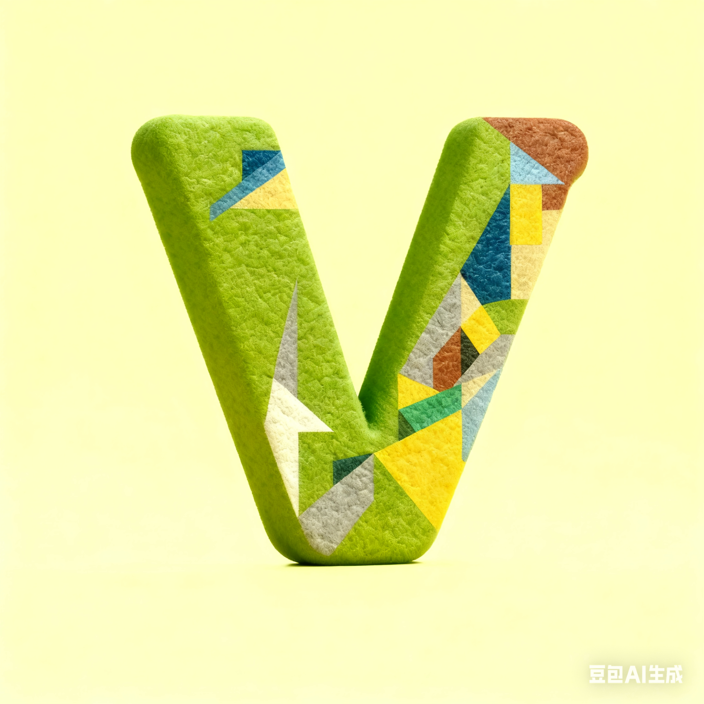

<div align="center">
    
</div>

<div align="center">
    <h1>Awesome Vivaldi</h1>
<div align="center">

[](https://deepwiki.com/PaRr0tBoY/Awesome-Vivaldi)
[](https://forum.vivaldi.net/topic/112064/modpack-community-essentials-mods-collection?_=1761221602450)


</div>
    <p>A Curated Community Mod Pack for Vivaldi Browser</p>

<div align="center">

**English** | [简体中文](../Doc/READMEZH/README79.md)

</div>

<!-- 


<br/>

<br/> -->

</div>

<br/>

## Table of Contents

- [How to install](#how-to-install)
  - [Vivaldi Settings](#vivaldi-settings) 
  - [CSS Mods](#to-install-css-mods)
  - [Javascripts Mods](#to-install-javascripts-mods)
- [Update](#update)
- [Development](#development)
- [Frequently Asked Questions](#faq)


## How to install

### Vivaldi Settings
- Go to `vivaldi:settings/appearance/` -> `UI AUTO-HIDE`, Toggle `Enable UI Auto-hide` on.
- Go to `vivaldi:settings/tabs/` -> `Tab Stacking`, Switch `Tab Stacking` to Two-Level . (Don't `Use Compact Display Style`)
- Go to `vivaldi:settings/tabs/` -> `New Tab Position`, Toggle to `As Tab Stack with Related Tab`.
- Go to `vivaldi:settings/qc/` -> `Quick Command Options`, Toggle `Open Links in New Tab` on.

### To Install CSS Mods

1. Open the url `vivaldi://flags/#vivaldi-css-mods`
2. Enable the flag, restart the browser as prompted
3. Open Appearance section in Settings
4. Under "Custom UI Modifications" choose the folder you want to use
5. In this modpack, we use `Import.css` as css mods manager.
6. Select the folder where `Import.css` is under as css folder to install.
7. Restart Vivaldi to see them in effect

IMPORTANT:
The CSS files can't have spaces in the filename or they won't work. Spaces in directory/path names should work but try to avoid it just in case.

In addition, make sure the file(s) actually have the extension .css - if you're on Windows make sure file name extensions are set to show

Important Note for 7.7+ users!
All experiments are now located under vivaldi://flags/
To enable CSS mods use the search field with "vivaldi-" or go to
chrome://flags/#vivaldi-css-mods and set to Enabled.

### To Install Javascripts Mods

#### Install Automatically

1. If you're on windows, use [Vivaldi Mod Manager](https://github.com/eximido/vivaldimodmanager)
2. If you're on linux, see [Vivaldi-Autoinject-Custom-js-ui](https://aur.archlinux.org/vivaldi-autoinject-custom-js-ui.git) for more info
3. See also [Patching Vivaldi with batch scripts](https://forum.vivaldi.net/topic/10592/patching-vivaldi-with-batch-scripts/21?page=2) for all platform
4. If you're on macOS use [macOS_Patch_Scripts | upviv](https://github.com/PaRr0tBoY/Vivaldi-Mods/blob/8a1e9f8a63f195f67f27ab2e5b86c4aff0081096/MacOSPatchScripts/upviv) as a reference for patchscript

#### Install Manually

There is only one single file in Vivaldi that you should ever need to modify. This file is called window.html and located at:

<YOURVIVALDIDIRECTORY>\Application\<VERSION>\resources\vivaldi

⚠ You should back it up before you fiddle with it.
==Especially window.html. If it's falsely configured your browser might break.==

To install, Just copy all the content under ./Javascripts/ to your `<YOURVIVALDIDIRECTORY>`\Application\<VERSI0N>\resources\vivaldi\

##### What It Does?

1. All the javascripts mods is copied to `<YOURVIVALDIDIRECTORY>`\Application\<VERSI0N>\resources\vivaldi.
2. Under the same folder, a window.html has been modified,which injected javascripts mods to your browser.
3. Restart to see the effect
4. You can confirm your installation at vivaldi:inspect/#apps.
 a. Click on the blue inspect button of window.HTML and open a console windlw
 b. Check the elements tab. If you see the js mods list. It's installed.
`Modified window.html` looks like this.

```html
<!-- Vivaldi window document -->
<!DOCTYPE html>
<html>
  <head>
    <meta charset="UTF-8" />
    <title>Vivaldi</title>
    <link rel="stylesheet" href="style/common.css" />
    <link rel="stylesheet" href="chrome://vivaldi-data/css-mods/css" />
  </head>

  <body>
    <script src="TidyTitles.js"></script>
    <script src="TidyTabs.js"></script>
    <script src="TidyDownloads.js"></script>
    <script src="AskOnPage.js"></script>
    <script src="TabScroll.js"></script>
    <script src="MonochromeIcons.js"></script>
    <script src="VividAddress.js"></script>
    <script src="QuickCapture.js"></script>
    <script src="GlobalMediaControls.js"></script>
    <script src="EasyFiles.js"></script>
    <script src="ModConfig.js"></script>
    <script src="VividPeek.js"></script>
  </body>
</html>
```

3. That's it! Restart browser to see the effect. If any other issues please report it at [Issues · PaRr0tBoY/Awesome-Vivaldi](https://github.com/PaRr0tBoY/Awesome-Vivaldi/issues?q=sort%3Aupdated-desc+is%3Aissue+is%3Aopen) and I'll ~~probably~~ fix it at weekend.

> Optionally, get an free OpenAI-Compatible Api Key here for AI features [cheahjs/free-llm-api-resources](https://github.com/cheahjs/free-llm-api-resources?tab=readme-ov-file#opencode-zen).

### Settings Panel

`ModConfig.js` adds an Awesome Vivaldi section to Vivaldi's Appearance settings page. To use it:

1. Install `ModConfig.js` together with the other JavaScript mods and restart Vivaldi.
2. Open `vivaldi:settings/appearance/`.
3. Find the Awesome Vivaldi settings section.
4. Use **AI Config** for the shared OpenAI-compatible endpoint, API key, model, and per-mod overrides.
5. Use **Arc Peek** to configure Peek triggers:
   - `Click Modifiers`: modifier keys for normal left-click Peek opening.
   - `Long Press Buttons`: mouse buttons that open Peek after holding.
   - `Hold Time` / `Hold Delay`: long-press timing in milliseconds.
   - `Auto Open List`: `pin` for pinned tabs, or domain patterns such as `*.google.com`.
   - `Foreground Mode`: blank loading layer style.
   - `Scale Background`: whether the underlying page sinks while Peek is open.
6. Use **Quick Capture** and **Auto Hide Panel** for their matching behavior settings.
7. Click **Save** after changing settings. Use **Import** / **Export** to move the same config between profiles.

Settings are stored in the browser's local Origin Private File System under `.askonpage/config.json`, and supported mods reload the saved values automatically.

## Update

If you have previously installed this modpack, you can update to the latest version by cloning the repository and re-running the installation:

```bash
# Clone or pull the latest changes
git clone https://github.com/PaRr0tBoY/Awesome-Vivaldi.git
# Or if you already have it cloned:
cd path/to/Awesome-Vivaldi
git pull

# Re-install CSS mods
# Copy the contents of Vivaldi7.9Stable/ to your Vivaldi CSS mods folder

# Re-install JavaScript mods
# Copy the contents of Vivaldi7.9Stable/Javascripts/ to your Vivaldi resources directory
# Then update window.html with any new script references
```

## Development

### Architecture Overview

- **CSS Mods**: Referenced via `@import` in `Import.css`. Place new CSS files in the `CSS/` folder and add an import statement in `Import.css`.
- **JavaScript Mods**: Referenced via `<script>` tags in `window.html`. Place new JS files in the `Javascripts/` folder and add a script reference in `window.html`.

### File Metadata

Each file should include metadata at the top to describe its purpose, author, and usage:

#### CSS Files (UserStyle format)

```css
/* ==UserStyle==
 * @name         Your Mod Name
 * @description  Brief description of what this mod does
 * @version      YYYY.MM.DD
 * @author       Your Name
 * @website      https://github.com/PaRr0tBoY/Awesome-Vivaldi
 * ==/UserStyle==
 */
```

#### JavaScript Files (UserScript format)

```javascript
// ==UserScript==
// @name         YourMod
// @description  Brief description of what this mod does
// @version      YYYY.MM.DD
// @author       Your Name
// ==/UserScript==
```

### Inspecting Vivaldi UI

Use `vivaldi:inspect/#apps` to inspect Vivaldi's own UI elements. Click the blue **inspect** button of `window.html` to open DevTools for the browser chrome. The [Vivaldi UI Inspect Tutorial](https://forum.vivaldi.net/post/135732) covers this in detail.

### CSS Gotchas

- **CSS variables may break between versions**: Always verify with Computed Styles in DevTools. Hardcoded `px` values are safer than relying on `var()` fallbacks.
- **CSS Anchor Positioning is unreliable**: Vivaldi has incomplete support. Use `left: 50%; transform: translateX(-50%)` instead of `anchor-center`.
- **`:has()` enables backwards selection**: When a later DOM element needs to style an earlier one (common in Vivaldi's DOM order), use `:has()` on a common parent.
- **Vivaldi sets inline styles via JS**: Use `position: fixed !important` or `!important` overrides to escape inline `top`/`left` calculations.

### JavaScript Gotchas

- **window.html scripts are MV3-like**: `chrome.scripting.executeScript` works, but `chrome.tabs.executeScript` does not.
- **MutationObserver needs persistent anchors**: Workspace switching rebuilds `.tab-strip`. Attach observers to `#browser` (safe anchor) and rebind inner observers when the strip is rebuilt.
- **URL validation before injection**: `chrome.tabs.executeScript` throws on `chrome://` / `vivaldi://` pages. Always check `tab.url` first.

### Resources

To learn about Vivaldi's internal APIs and contribute to the modpack, check out:

- **[PrettyBundle.js](../Others/UsefulResources/Source/source/pretty-bundle.js)** and **[common.css](../Others/UsefulResources/Source/source/common.css)** — Vivaldi's core bundle files that reveal internal APIs
- **[Doc/](../Doc/)** — Documentation on Vivaldi's JavaScript mods API
- **Vivaldi Browser Source**: https://github.com/ric2b/Vivaldi-browser
- **DeepWiki (Vivaldi Source)**: https://deepwiki.com/ric2b/Vivaldi-browser
- **Lonm's Vivaldi Modders API Reference**: https://lonmcgregor.github.io/VivaldiModdersAPI/OfficialApi/everything.html

### Vivaldi CSS Variables

Vivaldi exposes theme-aware CSS custom properties on `#browser`. These follow the user's active theme — values change with theme, so reference by `var()` name only.

| Category                             | Key variables                                                                                                                                                                                           |
| ------------------------------------ | ------------------------------------------------------------------------------------------------------------------------------------------------------------------------------------------------------- |
| **Background**                 | `--colorBg`, `--colorBgAlpha`, `--colorBgDark`/`--colorBgDarker`, `--colorBgLight`/`--colorBgLighter`, `--colorBgIntense`/`--colorBgIntenser`, `--colorBgInverse`, `--colorBgFaded` |
| **Foreground**                 | `--colorFg`, `--colorFgIntense`, `--colorFgFaded`/`--colorFgFadedMore`/`--colorFgFadedMost`                                                                                                   |
| **Highlight** (primary accent) | `--colorHighlightBg`, `--colorHighlightFg`, `--colorHighlightBgDark`, `--colorHighlightBgAlpha`                                                                                                 |
| **Accent** (secondary)         | `--colorAccentBg`, `--colorAccentFg`, `--colorAccentBorder`, `--colorAccentBgDark`/`--colorAccentBgDarker`                                                                                    |
| **Border**                     | `--colorBorder`, `--colorBorderSubtle`, `--colorBorderIntense`, `--colorBorderDisabled`                                                                                                         |
| **Semantic**                   | `--colorSuccessBg`/`Fg`, `--colorWarningBg`/`Fg`, `--colorErrorBg`/`Fg`                                                                                                                     |
| **Radius**                     | `--radius`, `--radiusHalf`, `--radiusCap`, `--radiusRound`, `--radiusRounded`                                                                                                                 |
| **Other**                      | `--colorTabBar`, `--densityGap`, `--scrollbarWidth`, `--monospaceFont`, `--sansSerifFont`, `--uiZoomLevel`                                                                                  |
---

## FAQ

### ❓ What is OpenAI-compatible API?

[See the explanation here](https://bentoml.com/llm/llm-inference-basics/openai-compatible-api#:~:text=What%20is%20an,across%20various%20industries.)

### ❓ I installed everything, but nothing changed

**Check these first:**
- [ ] Enable **CSS Customization** at `vivaldi://flags`
- [ ] Set correct folder path  
  → `Settings > Appearance > Custom UI Modifications`  
  → `Awesome-Vivaldi-main\Vivaldi7.9Stable`
- [ ] Copied all the **contents** under [./Javascripts](./Javascripts/) to your `<YOURVIVALDIDIRECTORY>\Application\<VERSI0N>\resources\vivaldi\`

---

### ❓ Why are some features missing?

#### 🤖 AI features not working
These mods **do NOT work out of the box**.

You must configure your own **OpenAI-compatible API**  
→ Edit the first few lines in the script files.

---

#### ⭐ FavouriteTabs not showing
- Only **first 9 pinned tabs / tab stacks** are turned into grids.
- Which means you need to pin at least one tabs to see it take effect.
- This mod often causes side effect, for instance, break location of tabs' popup thumbnails.

---

### ❓ I installed it correctly, but still don’t see changes

That’s normal.

- Many mods run **in the background**
- Effects may be subtle or only appear in specific situations

👉 Check the [Mod List](#mod-list) to understand what each one does

---

### ❓ Some features seem disabled

Some mods are intentionally turned off (buggy / unfinished)

**Enable them manually:**
- CSS mods → [Import.css](./Import.css)
- JS mods → [window.html](./Javascripts/window.html)

---

### ❓ Still not working?

- Restart Vivaldi
- Double-check file paths (most common issue)
- Make sure files were actually replaced (not copied alongside)
